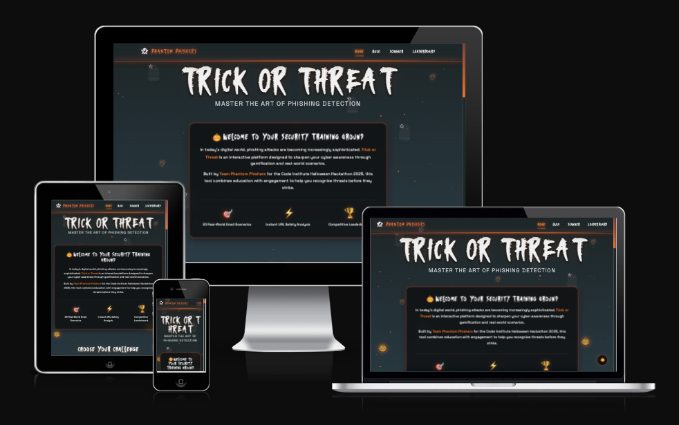
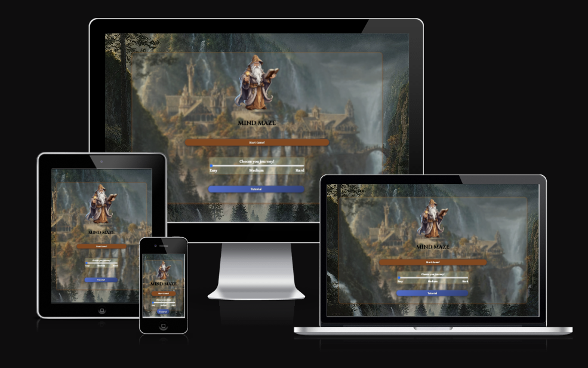

  

###

  
  

  

###

<h1 align="center">👋 Hey there! I'm Dinesh. </h1>
 

  
I’m a **Full Stack Software Developer**, passionate about building intuitive and engaging web applications that drive real impact.  
I love crafting clean, user-friendly solutions with **Python**, **Django**, **JavaScript** and I’m currently exploring **React** and other modern front-end technologies.  

After nearly a decade as a **Verification Engineer**, I’ve brought my analytical mindset, attention to detail, and love for problem-solving into the world of software development — where creativity meets logic. 

I enjoy collaborating on meaningful projects, learning new technologies, and contributing to the developer community - feel free to reach out!  

 

---

 
 

<h2 align="center">✨ Featured Projects</h2>
<table align="center">
  <tr>
    <td align="center">
      <h3>Pantry Pilot</h3>
      
Full-stack application to help users manage pantry inventory, discover recipes, and plan meals and generate shopping lists efficiently
       
      Developed as my capstone project for Code Institute Bootcamp.
      

      

        
        
        
        
        
        
        
      

       
      <a href="https://pantry-pilot-745736b33f31.herokuapp.com/">Live Preview</a>
       
       
      
    </td>
  </tr>
  
  <tr>
    <td align="center">
      <h3>DEI Decoded</h3>
      
Single page static website to designed as a beginner-friendly resource for DEI in workplace and educational settings.
       
      Developed as my first flagstone project for Code Institute Bootcamp.
      

      

        
        
        
      

       
      <a href="https://sthdinesh.github.io/dei-decoded/">Live Preview</a>
       
       
      
    </td>
  </tr>
</table>

 
 

<h2 align="center">🎪 Hackathons</h2>
  
Participated in multiple hackathons and contributed to front-end, back-end, and full-stack development, collaborating with diverse teams to bring ideas to life. 

Also contributed as Scrum Master, helping teams stay organized, focused, and agile throughout the development process.

<table align="center">
  <tr>
    <td align="center">
      <h3>Trick or Threat</h3>
      
A Halloween-themed cybersecurity toolkit for detecting and learning about phishing attacks. Check sketchy URLs, take quizzes on fake emails, and compete on the leaderboard.

      

        
        
        
        
        
        
        
      

       
      <a href="https://phantom-phish-buster-2f6a1ce98088.herokuapp.com">Live preview</a>
       
       
      
    </td>
  </tr>
  <tr>
    <td align="center">
      <h3>backSpace</h3>
      
Full-stack workspace booking system that allows users to book desks, meeting rooms, and collaboration spaces 

      

        
        
        
        
        
        
      

       
      <a href="https://backspace-c8042b918673.herokuapp.com/">Live preview</a>
       
        
      
    </td>
  </tr>
  <tr>
    <td align="center">
      <h3>MindMaze</h3>
      
An engaging, responsive web-based puzzle game that combines maze navigation with trivia challenges, creating a unique blend of spatial reasoning and knowledge-based gameplay for players of all skill levels.

      

        
        
        
        
      

       
      <a href="https://nicolae-cristoloveanu.github.io/mind-maze-hackathon-ci/">Live preview</a>
       
       
      
    </td>
  </tr>
</table>

 
 

<h2 align="center">🧰 What I Work With</h2>

<h3 align="center">Languages & frameworks</h3>

  
  
  
  
  
  
  
  
  

<h3 align="center">Tools and Workflow </h3>

###

  
  
  
  
  
  
  
  

 
 

---

 
<h2 align="center">🤝 Let's Connect!</h2>

I'm always open to new challenges, exciting ideas, and opportunities to collaborate.  

Let’s **connect**, **build**, and **learn together** — feel free to reach out! 💬  

  
  

