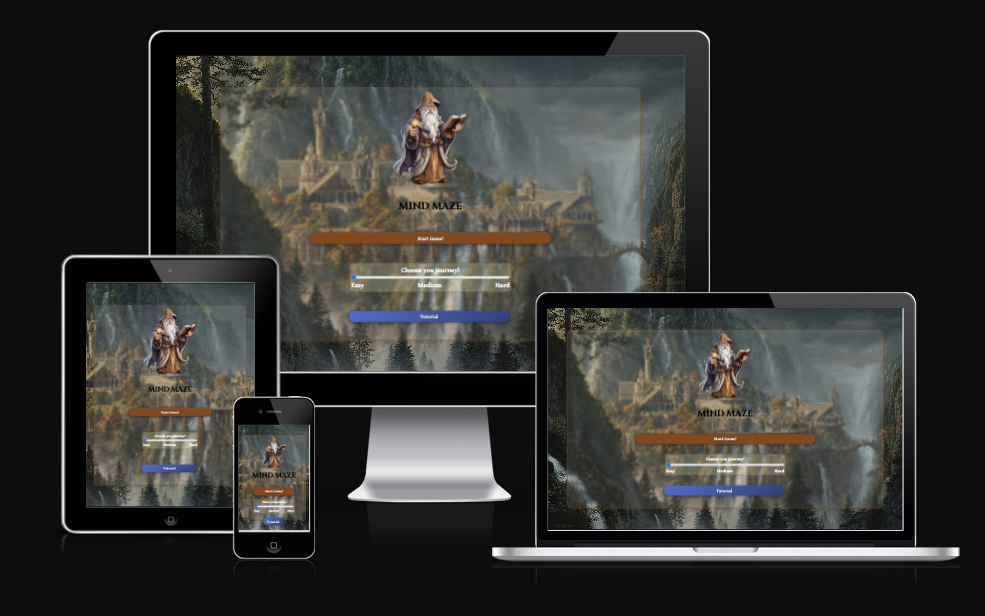

  

###

  
  

  

###

<h1 align="center">👋 Hi! I'm Dinesh. </h1>
 

<h3 align="center">Software Engineer | Data Engineering | Full-Stack Development </h3> 

I'm an engineer with 9+ years of professional engineering experience, now focusing on Data Engineering and Full-Stack Development.

My background in verification engineering includes Python automation, performance analysis and building tools to improve engineering workflows. I'm now applying that experience to building data pipelines, backend services and full-stack applications.
  
 

---

 
 
<h2 align="center">✨ Currently working on...</h2>
<table align="center">
  <tr>
    <td align="center">
      <h3>Vertex</h3>
      
AI-powered learning companion that maps the path to understanding
       
      

      

        
        
        
        
        
        
        
        
      

       
      <a href="https://vertex-eta-tawny.vercel.app/">Live Preview</a>
       
       
    </td>
  </tr>
</table>
 

---

 

<h2 align="center">✨ Featured Projects</h2>
<table align="center">
  <tr>
    <td align="center">
      <h3>Pantry Pilot</h3>
      
Full-stack application to help users manage pantry inventory, discover recipes, and plan meals and generate shopping lists efficiently
       
      Developed as my capstone project for Code Institute Bootcamp.
      

      

        
        
        
        
        
        
        
      

       
      <a href="https://pantry-pilot-745736b33f31.herokuapp.com/">Live Preview</a>
       
       
      
    </td>
  </tr>
  
  <tr>
    <td align="center">
      <h3>Plants 101</h3>
      
An AI-powered plant information platform developed as a team project.
      
Features end-to-end ETL pipeline to ingest, clean and transform plant data from REST APIs into MongoDB and AWS S3.
Semantic search and retrieval-augmented generation (RAG) using Sentence Transformers, FAISS and Gemini.
      

      
        

       
      
 <a href="https://github.com/sthDINESH/se-plant-etl-project">View Repository</a> 

  </tr>
</table>

 
 

<h2 align="center">🎪 Hackathons</h2>
  
<table align="center">
  <tr>
    <td align="center">
      <h3>Trick or Threat</h3>
      
A Halloween-themed cybersecurity toolkit for detecting and learning about phishing attacks. Check sketchy URLs, take quizzes on fake emails, and compete on the leaderboard.

      

        
        
        
        
        
        
        
      

       
      <a href="https://phantom-phish-buster-2f6a1ce98088.herokuapp.com">Live preview</a>
       
       
      
    </td>
  </tr>
  <tr>
    <td align="center">
      <h3>backSpace</h3>
      
Full-stack workspace booking system that allows users to book desks, meeting rooms, and collaboration spaces 

      

        
        
        
        
        
        
      

       
      <a href="https://backspace-c8042b918673.herokuapp.com/">Live preview</a>
       
        
      
    </td>
  </tr>
  <tr>
    <td align="center">
      <h3>MindMaze</h3>
      
An engaging, responsive web-based puzzle game that combines maze navigation with trivia challenges, creating a unique blend of spatial reasoning and knowledge-based gameplay for players of all skill levels.

      

        
        
        
        
      

       
      <a href="https://nicolae-cristoloveanu.github.io/mind-maze-hackathon-ci/">Live preview</a>
       
       
      
    </td>
  </tr>
</table>

 
 

<h2 align="center">🧰 What I Work With</h2>

<h3 align="center">Languages & frameworks</h3>

  
  
  
  
  
  
  
  
  
  
  

<h3 align="center">Data, databases & cloud</h3>

  
  
  
  
  
  
  

<h3 align="center">AI & search</h3>

  
  
  
  

<h3 align="center">Tools & workflow</h3>

  
  
  
  
  
  
  

 
 

<h2 align="center">📚 Currently Learning</h2>

🔹 **Modern Data Engineering**
Data pipelines, cloud-based data systems & scalable data workflows

🔹 **Cloud & DevOps**
Docker, Kubernetes & AWS

🔹 **Software Engineering**
Building reliable, maintainable & scalable applications

---

 
<h2 align="center">🤝 Let's Connect!</h2>

I'm interested in opportunities in **Data Engineering and Full-Stack Development**, as well as collaborating on practical software and data projects.

  
  

